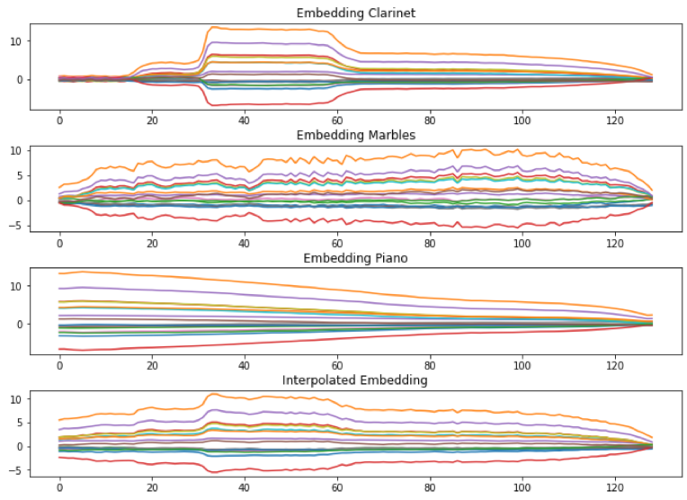
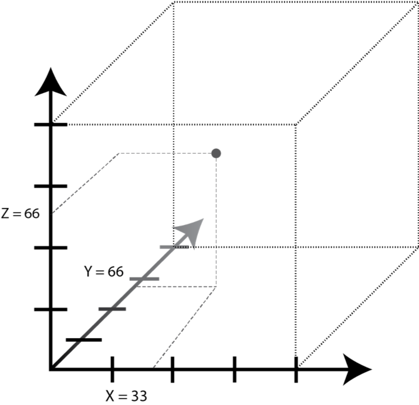

# Timbre interpolation explorer

Project made for Machine Learning for Audio class at Wesleyan University.

This project contains two parts:
- Script used to create a 3D grid of different levels of interpolation between timbres of 3 different sound sources, found in project's root directory.
It uses the Machine Learning library [Magenta](https://magenta.tensorflow.org/).

- Interactive system used to explore resulting corpus of sounds by using a Leap Motion sensor, found in the "interactive_system" directory.

By [Héctor González Orozco](https://github.com/hectorgonzalezo)

## :computer: Built With

* [Python](https://www.python.org/)
* [Magenta](https://magenta.tensorflow.org/)
* [SuperCollider](https://supercollider.github.io/)
* [Leap Motion](https://www.ultraleap.com/product/leap-motion-controller/)

## :pager: Colab notebook

You can also run the script interactively using this [Google colab notebook](https://colab.research.google.com/drive/1B1TikSrq0XeXJ0EvMzDXuQe4UqVFXsj7)

## :rocket: Features

- 3D timbre interpolation using pre-trained unsupervised learning neural network.

- Options to run script using single and multithreading.

- Interactive interface to explore sounds in virtual 3D space.

## :construction: Installing

### Running the timbre interpolator

Requires Python 3.7 or higher.

1. Clone the repository

`git clone https://github.com/hectorgonzalezo/timbre_explorer`

2. Install gdown

`pip install gdown`

3. Download sound examples

`./downloadfiles.sh`

4. Run single threaded script:

`python3 timbre_explorer.py`

or multithreaded version:

`python3 timbre_explorer_mpi.py`

---

### Running the interactive system

Requires Python 2.7

Your sounds must be contained in a directory within "sounds";

1. Move to system directory

`cd interactive_system`

2. Install supercollider, you can find it in your favorite package manager like this:

`brew install supercollider`

3. Add Open Sound Control library for Python:

`cd LeapMotionViaPython && git clone https://github.com/ptone/pyosc && cd ..`

This is the protocol used to communicate between the Leap Motion controller and SuperCollider

4. Plug in the Leap Motion Controller and run:

`python LeapMotionViaPython/leap.py`

This will convert the data coming from the controller to the OSC protocol

5. Open "player.scd" in SuperCollider, select the first line in the file and command/ctrl + return/enter

## :notebook: Research Paper

### Background

Sound synthesis consists in generating audio signals from scratch using electronic hardware or software. Analog synthesis employs continuous signals usually generated and modified by electrical circuits such as oscillators, noise generators, filters, and envelope generators. Digital synthesis, on the other side, involves generating or modifying via software discrete signals consisting of individual and closely spaced samples that usually determines the position of a speaker cone in time. The most common use of sound synthesis is for musical purposes, starting with the creation of musical instruments such as the Tellharmonium and the Theremin in the late 19th and early 20th centuries and evolving to such iconic instruments as the Moog, Arp and Yamaha DX7.

There are many techniques for sound synthesis such as additive, subtractive and modulation synthesis. Additive synthesis involves combining multiple sinewaves to create timbre, this is done by spacing them apart as an overtone series and carefully choosing their amplitude. Subtractive synthesis consists in removing or boosting spectral areas of complex signals (such as white noise). Frequency or amplitude modulation involves in altering those parameters of a waveform by using another oscillator, usually at an audio frequency (above 20Hz). Many other techniques have been developed, but what they all have in common is that they involve shaping sound at a high level. Few are concerned in dealing with audio on a sample-to-sample level, given the overload of data required to do so.

The technique I’m employing is a novel one called NSynth (Engel et al., 2017), which generates audio signals on a sample-by-sample level using a neural network model. The functions required to implement it are part of [Magenta](https://magenta.tensorflow.org/), an open-source machine learning Python library geared towards generating music and visual art. The model I’m using analyses sounds and creates a series of hidden embeddings that can be combined with others to effectively be resynthesized as sounds whose timbre consists of a linear interpolation between their respective timbres. This can be expanded to include interpolation between more than two sounds and adding weights to each embedding to determine the percentage of each sound present in the output. 

As a composer of electroacoustic music, I’m always trying to find new sonic possibilities to explore as material for my pieces, and in this case, this involves finding strategies to explore the multitude of sounds created and easily compare them with one another. I decided to assemble sounds on a 3-dimensional space (fig 2.), where moving along each axis involves adding more of that timbre to the resultant sound in 1⁄4 increases (that is, quantized to 4 steps). Furthermore, I created a system to interactively explore such space with hand gestures using a Leap Motion Controller. The right hand selects previously resynthesized sounds by moving through space, while the left can select sounds by making a grabbing gesture that’s recognized as such by a classifier using Wekinator (Fiebrink et al., 2009).

### Model & Data

Autoencoder neural networks are unsupervised learning algorithms that can create compressed (latent-space) representations of the input data, and then reconstruct a meaningful representation of the original data using such representation. These two steps are respectively called the “Encoder” and “Decoder”. The model effectively creates a reconstruction of the input data. This would be a trivial pursuit were it not for the case that it can learn to detect some structures in the data that can be further reconstructed in a different way. Therefore, they have been employed for uses such as removing noise from images and translating text. Its usefulness lays in the latent- space representation, which can be shaped in any desirable way or fed into a different kind of decoder. Autoencoders are also generative models, which mean they can generate new data that is similar to the input.

The model I employed is based on WaveNet, an audio generative model that operates “directly on the raw audio waveform” (van der Oort et al., 2016). However, the need for external conditioning inherent in the original model is bypassed by using the hidden embedding as conditioning and therefore recreating the original signal. It is called “WaveNet Autoencoder” (Engel et al., 2017).

This model is pretrained by feeding it a large dataset of raw audio, in this case 4 second musical notes found in the “NSynth Dataset” (explained below), allowing it to infer a useful representation for the embeddings. Training a different model would have been next to impossible given the resources I have at hand, as it [“takes around 10 days on 32 K40 gpus (synchronous) to 4 converge at ~200k iterations”](https://github.com/magenta/magenta/tree/main/magenta/models/nsynth).

The encoder involves a 30-layer network of dilated convolutions followed by 1x1 convolutions, each one preceded by rectified linear activation functions. The result is then fed into another 1x1 convolution and then downsampled to get the encoding. A single 16-dimensional point is inferred every 512 samples, therefore getting a 125x16 embedding for 4 seconds of audio sampled at 16kHz (the only available sample rate). The decoder takes the embeddings and upsamples them to the original rate with nearest neighbor interpolation. Each sample of the resultant audio is chosen based on its probability given every sample that came before, conditioned by the embedding. Both steps are influenced by the pretrained model, available as a TensorFlow checkpoints on the Magenta GitHub repository (link [here](https://github.com/magenta/magenta/tree/main/magenta/models/nsynth)).

Embeddings of multiple sounds can be combined in any desirable way before decoding. Fig 1 shows an example where each embedding is divided by three, leading to each one having an equal weight in the resultant sound (1:1:1 ratio). Each one of the 16 channels is shown in a different color. The influence of every sound in the interpolated embedding is clear by simply looking at the way the embedding is shaped, with jagged edges like the second embedding and a combination of the envelopes of the second and third.

figure 1

The NSynth Dataset (Engel et al., 2017) consists of over 300k musical notes. Each one consists of a four second, monophonic sound sampled at 16kHz, at pitches corresponding to every one of the 88 keys of the piano (if available) and 5 different volumes taken from over 1000 instruments found in commercial sample libraries. Each note has an envelope with 3 seconds sustain and 1 second decay. Thus, the model trained on it is expected to learn to identify structures found in pitched sounds shaped in a very particular way.

Being a generative model means that it has certain advantages over simple convolution of signals or cross synthesis when it comes to creating timbre interpolations. The most important in my case being the tendency to add additional harmonics (even sub-harmonics) or dynamically mix the overtones in time. This creates a richer sound that creates subtle changes with every different weighting of the embeddings. I also became interest on experimenting by feeding it noisy sounds with very few pitch content (such as recordings of water and whispers) and attempting to interpolate between sounds with different pitches.

I wrote a Python script that takes 3 sounds as input, determines their embeddings, makes them all the same length, computes 43 different embeddings consisting of every combination of sounds and weights (0, 33, 66 and 100%), and then resynthesizes them. The process is time consuming: the later alone takes around 30 minutes for 4 seconds of audio with the hardware I had at my disposal, a long endeavor even when employing multithreading.

### Interactive System

figure 2

The system for interactive exploration of the resultant 64 sounds was built to fill out a virtual 3-Dimensional cubic space with smaller cubic areas corresponding to each sound. It involves tracking the position of the right-hand index finger and playing the sound corresponding to that point along the x, y and z axis in the virtual space, as can be seen in fig 2. If an interesting sound is found, a simple hand closing gesture with the left hand indicates the system to “grab” the sound so that it can be listened to and manipulated without having to keep the right hand still. Opening the left-hand allows the interaction to continue.

A Leap Motion controller is used as a hardware sensor to extract data about fingers motion and position. It employs infrared LEDs and cameras to observe a hemispherical area directly above itself, “it is based on binocular visual depth and provides data on fine-grained locations such as hands and knuckles” (Youchen et al., 2017). The data consists of positions of every joint and finger bone using a cartesian coordinate system in the hand can be extracted via the device’s API using Python. The coordinates of the very tip of the right-hand index finger distal phalange are sent to the playback system built on [SuperCollider](https://supercollider.github.io/) via the Open Sound Control protocol, a data transport specification built for real-time communication between applications and hardware and intended originally for musical purposes. The extension of the left-hand fingers is calculated by taking the difference between the position of each fingertip and the center of the palm, then it is sent via the same protocol to Wekinator to be classified.

Wekinator is an open-source software developed by Fiebrink (2009) for interactive machine learning and “tailored for musical applications including real-time audio analysis and gestural control of music” (Fiebrink, 2010). With its k-nearest neighbors’ classifier I trained a model to identify a “grab” gesture (closing left hand) using the previously mentioned finger extension data as input. It then sends the class inferred (0 or 1, gesture absent or present) in real-time to SuperCollider.

The patch programed in SuperCollider is then responsible for the playback of the audio files. The 64 sound files in every directory created by NSynth are loaded into buffers and placed according to their names into the 3-D space, different batches of interpolation spaces can be chosen by selecting them from a list in a drop-down menu. A graphical user interface gives feedback to the user about the finger position using a 2-D and one 1-D slider mapped to the coordinates. It also displays information about which axis corresponds to which original sound, and the weights on the sound currently being played. If the Wekinator classifier sends 1 then the whole system stops and the playback continues the current sound, which can then be listened to for as long as the user wishes or manipulated by using live-coding techniques. Furthermore, it is possible to explore the space by manipulating the percentages of each sound by incrementally adding it using a MIDI controller, such as using faders found on most commercial models.

### Findings

As mentioned before, the model I used was trained on instrument notes, with semi-stable harmonics and clearly defined pitch content. Therefore, it isn’t surprising to find that the resynthesis doesn’t work well with sounds with strong noise components (like the marbles example) or with sounds consisting of inharmonic overtones (like the clarinet multiphonic). Therefore, timbre interpolation with such sounds isn’t very perceptually convincing. The piano note was the only sound from the first set (fig. 1) whose structure the model captured properly, having the same 1 second decay time as the sounds in the NSynth dataset.

Similar unsuccessful results were achieved while interpolating between a sound of water flowing or whispers: the resynthesis was like the original only in that it contained a similar noise profile and articulations. Good enough to interpolate with another sound, but not to resemble the original sound in any perceptually meaningful way. Better results were achieved when using instruments playing individual notes, even when pitches differed from one another. The latter case sometimes created hybrid sounds with a complex evolution of overtones. Unsurprisingly, the most convincing (but not necessarily more interesting) interpolations are achieved when the three instruments play the same pitch, which is the way the model was trained.

The output sounds are usually low pass filtered (due to the 16kHz sample rate required) and share a crackly, grainy , and distorted quality at times, which might or might not be useful depending on the musical context. The probabilistic nature of the algorithm adds some noise to the signal, but also creates structures not existing in the original sound, in a way akin to Xenakis’ dynamic stochastic synthesis (Xenakis, 1971). Thus, the result is mostly unpredictable and nonlinear, with the 3-D exploration helping discover areas where new and sonically interesting structures emerge among unremarkable sounds. Many interesting sounds that would be hard to unearth by individual trial and error alone can be discovered by interactively exploring batches of interpolations.

### Conclusion

The interactive system developed helps in the navigation of a corpus of sounds created by incrementally interpolating between three sounds using the NSynth Wavenet autoencoder. This helped discover the possibility of, under certain conditions, creating 3-D spaces that convincingly interpolate between timbre using such model. Wherever this wasn’t achieved, the model still tried to fit known structures to the sounds, which sometimes resulted in interesting artificial intelligence assisted sound synthesis.

Even though the success of the model depends on generating audio signals serially, the long time it takes for each audio to be synthesized is a drawback of this model. Thus, employing it in real-time applications remains a very distant possibility. However, some research has been made on alternative was to synthesize audio using machine learning, such as Adversarial Neural Audio Synthesis (Engel et al., 2019), that generates audio sequences in parallel.

I personally enjoy the sound quality of the resultant sounds and find them inherently interesting and useful as material for electroacoustic music. Furthermore, even though there is room to grow in the development of the interactive system, I consider the exploration of the resultant space using hand position and gestures not only to be useful to discover sounds, but also an intuitive performative activity.

### Bibliography
- Du, Youchen, Liu, Shenglan, Feng, Lin, Chen, Menghui, & Wu, Jie. (2017). Hand gesture recognition
with leap motion. arXiv preprint arXiv:1711.04293.

- Engel, Jesse, Agrawal, Kumar Krishna, Chen, Shuo, Gulrajani, Ishaan, Donahue, Chris, & Roberts,
Adam. (2019). Gansynth: Adversarial neural audio synthesis. arXiv preprint arXiv:1902.08710.

- Engel, Jesse, Resnick, Cinjon, Roberts, Adam, Dieleman, Sander, Norouzi, Mohammad, Eck, Douglas, & Simonyan, Karen. (2017). Neural audio synthesis of musical notes with wavenet autoencoders. [Paper presentation]. International Conference on Machine Learning,

- Fiebrink, Rebecca, & Cook, Perry. (2010). The Wekinator: A System for Real-time, Interactive Machine Learning in Music. [Paper presentation]. Proceedings of The Eleventh International Society for Music Information Retrieval Conference (ISMIR 2010), Utrecht, Netherlands.

- Fiebrink, Rebecca, Cook, Perry, & Trueman, Dan. (2009, 2009). Play-Along Mapping of Musical Controllers Proceedings of the International Computer Music Conference (ICMC), Montreal, Canada.

- van den Oord, Aaron, Dieleman, Sander, Zen, Heiga, Simonyan, Karen, Vinyals, Oriol, Graves, Alex, Kalchbrenner, Nal, Senior, Andrew, & Kavukcuoglu, Koray. (2016). Wavenet: A generative model for raw audio. arXiv preprint arXiv:1609.03499.

- Xenakis, Iannis. (1992). Formalized music : Thought and mathematics in composition (Rev. ed.. ed.). Stuyvesant, NY : Pendragon Press.
